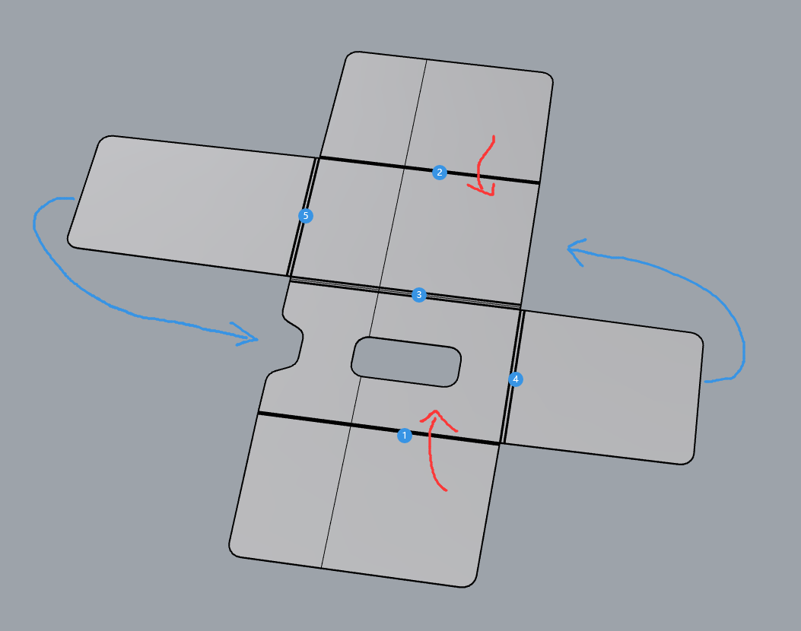
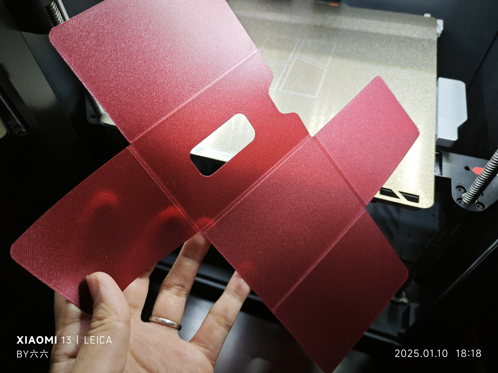
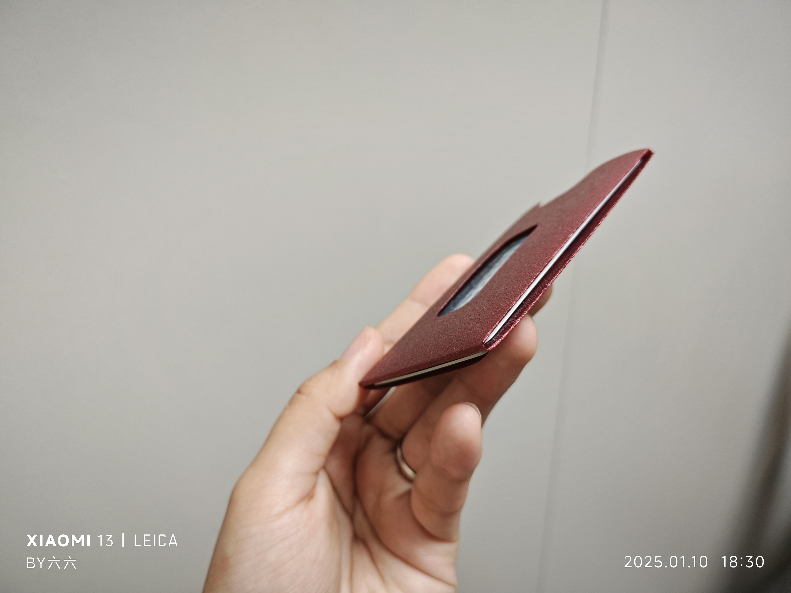
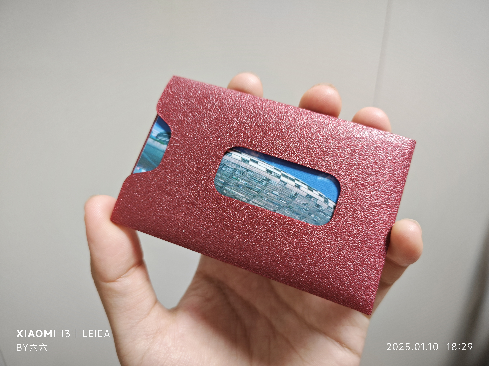

# Card Bag for 3 Cards

## Description
This is a compact card bag designed to hold three cards. Cards can be inserted from three directions, making it convenient to store different cards in a small space.

- **Printing Time:** 28 minutes
- **Material Usage:** 7g
- **Layer Height:** 0.1mm
- **Total Height:** 0.2mm

## Files
- `layerHeight0.1mm.stl`: The STL file for printing the model.
- `for3cards.3mf`: The 3MF file for easy printing with Orca or Bambu Studio.

## How to Use
1. Use the `.3mf` file in Orca or Bambu Studio for easy printing.
2. Print the model to create a compact card holder for three cards.
3. The card bag can hold three cards inserted from three directions.

## Folding Steps
To assemble the card bag, follow these folding steps:

   

## Real Shots
Here are some real-life images of the printed model:

### Demonstration GIF

## Design Philosophy
The design of this card bag is optimized for 3D printing. It aims to create a compact and functional holder for everyday cards, making it a perfect test model with practical use.

## License
This project is licensed under the [Creative Commons Attribution 4.0 International License](https://creativecommons.org/licenses/by/4.0/).
