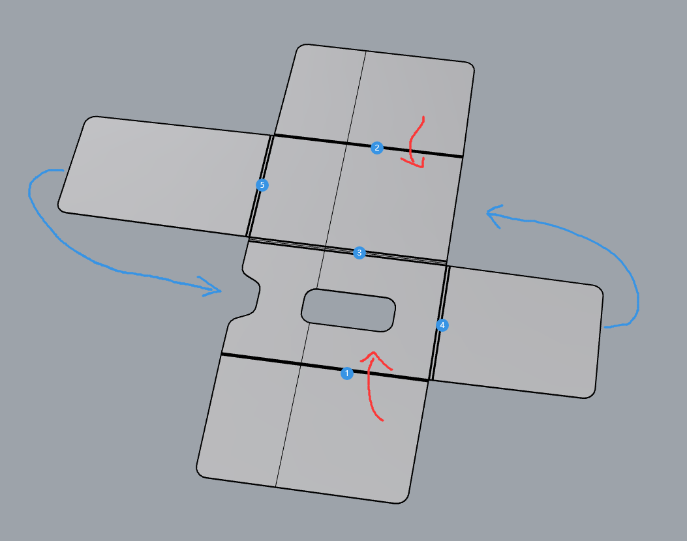
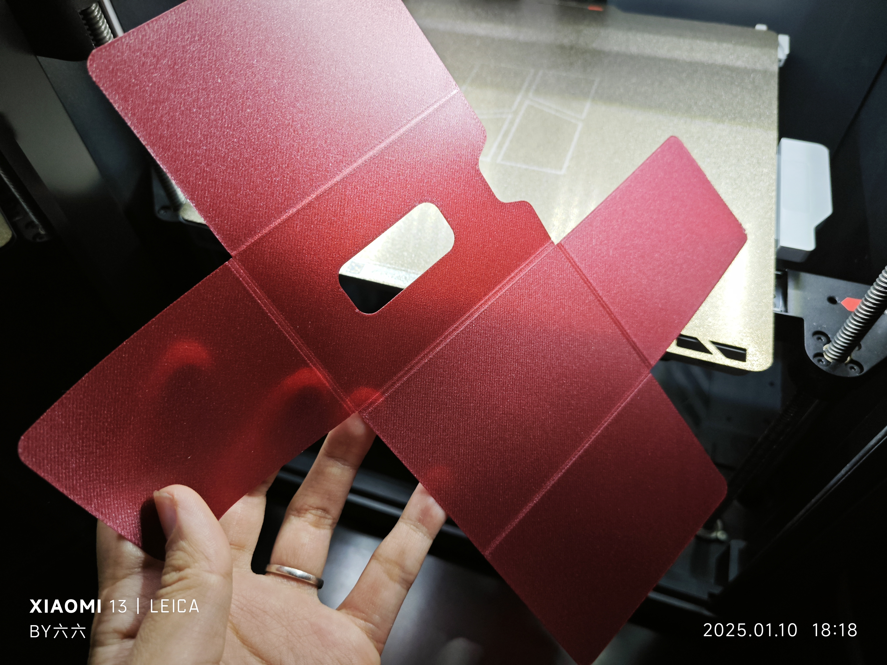
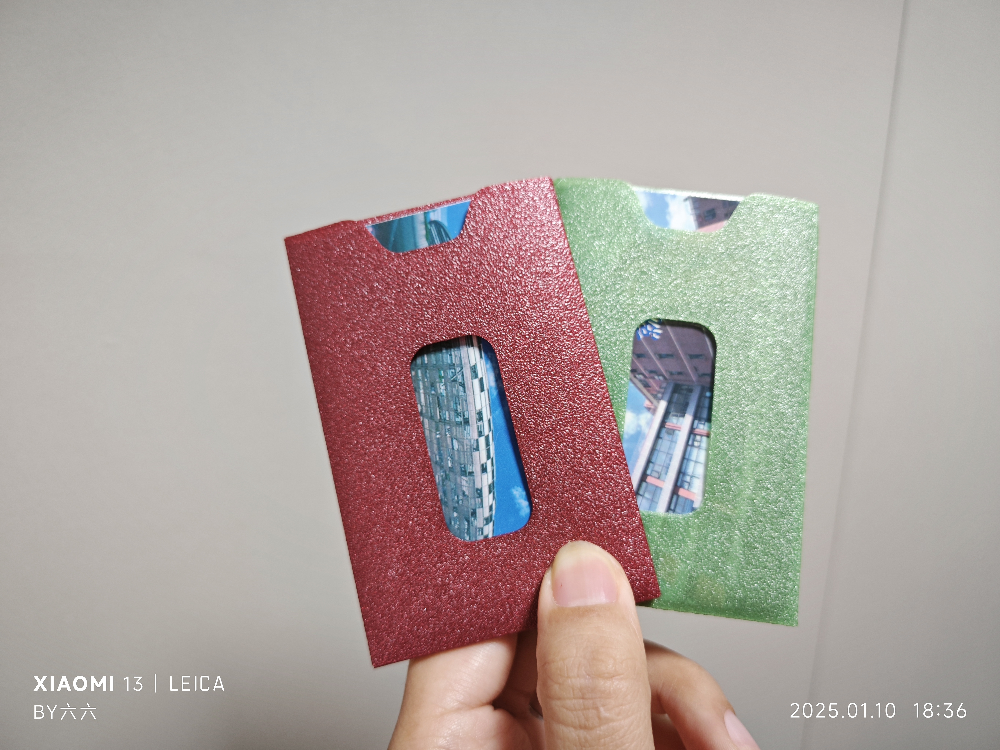
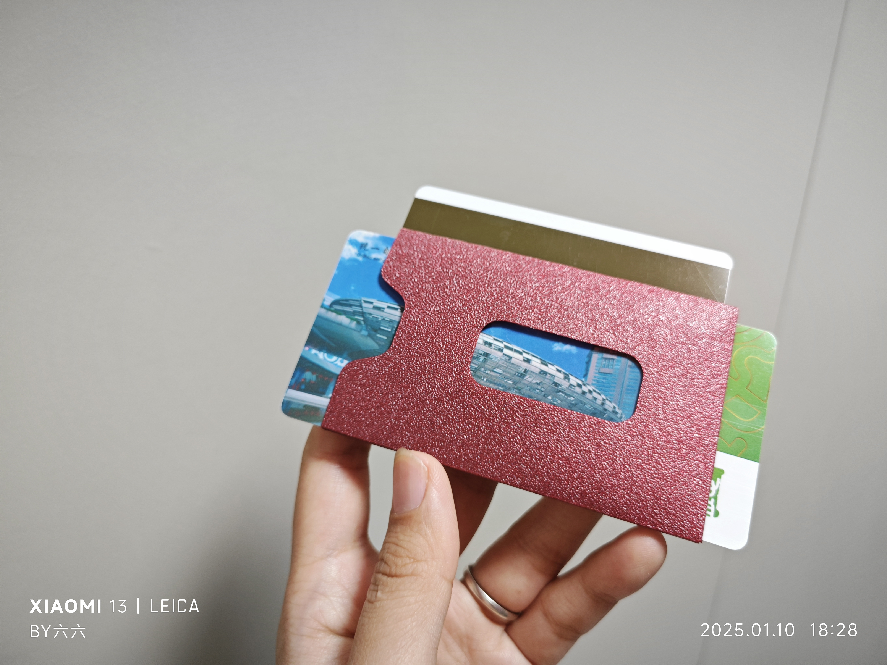
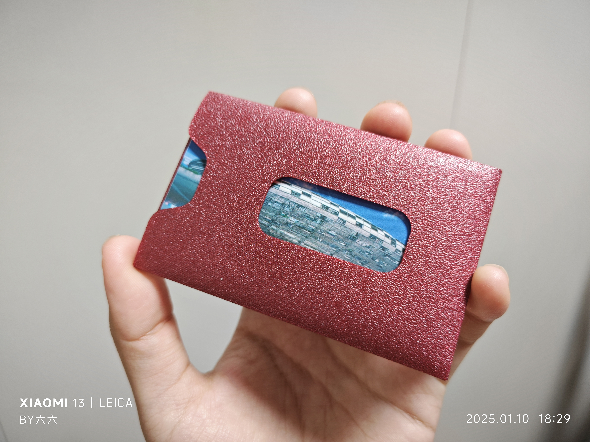
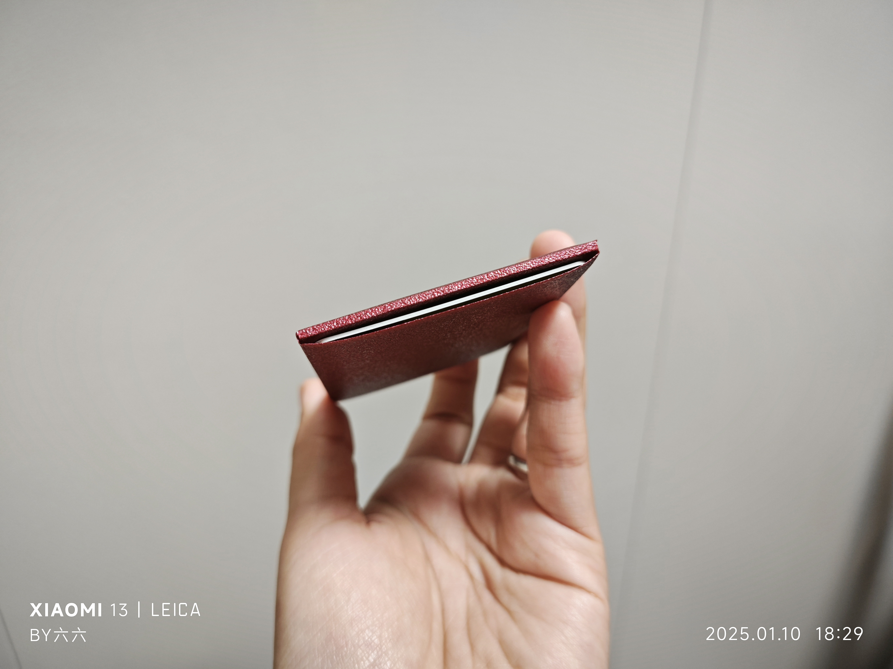
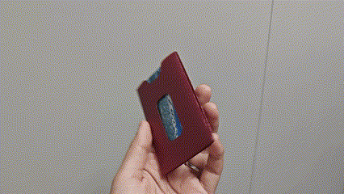

# 3张卡卡包

## 描述
这款卡包设计用于容纳三张卡。卡片可以从三个方向插入，方便地将不同的卡片存放在一个小空间内。

- **打印时间：** 28分钟
- **耗材使用：** 7g
- **打印层高：** 0.1mm
- **总高度：** 0.2mm

## 文件
- `layerHeight0.1mm.stl`：用于打印模型的STL文件。
- `for3cards.3mf`：方便使用 Orca 或 Bambu Studio 打印的 3MF 文件。

## 使用方法
1. 使用 Orca 或 Bambu Studio 打开 `.3mf` 文件，方便打印。
2. 打印模型，创建一个小巧的卡包，容纳三张卡。
3. 这款卡包可以从三个方向插入卡片。

## 折叠步骤
按照以下步骤进行卡包的折叠：

   
   

## 实拍图
以下是打印完成后的一些实拍图：

### 演示 GIF

## 设计理念
这款卡包的设计经过优化，旨在提供一个紧凑且功能性强的卡片收纳解决方案，同时也为3D打印优化。

## 许可证
本项目采用 [Creative Commons Attribution 4.0 International License](https://creativecommons.org/licenses/by/4.0/) 许可协议。
