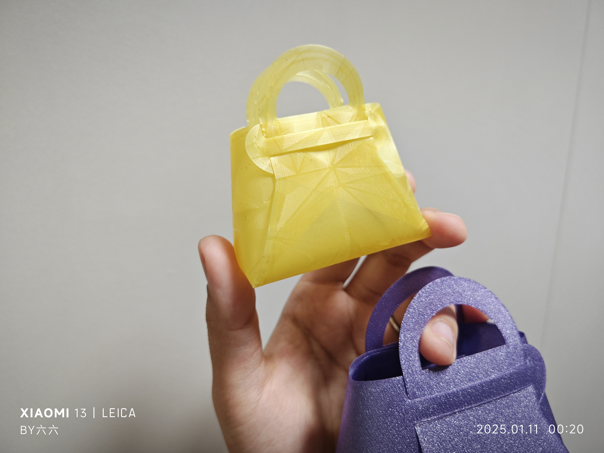
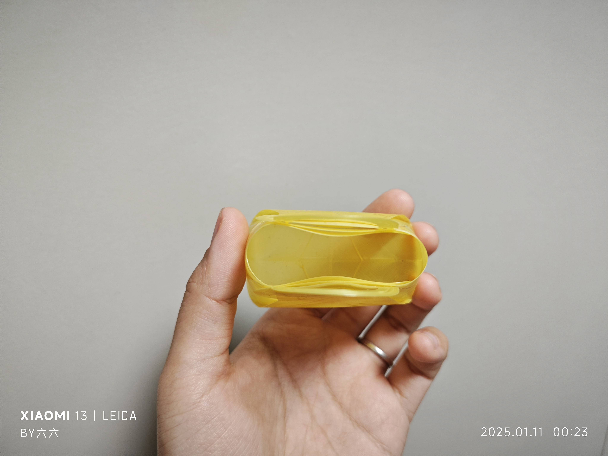

# Mini Basket Bag

## Description
This is a miniature basket-style bag. After printing, insert the handles through the slots on both sides to complete the basket. It can be used as a decoration for dolls or to hold small items like candies.

- **Printing Time:** 20 minutes
- **Material Usage:** 6g
- **Layer Height:** 0.2mm
- **Total Height:** 0.2mm
- - **Finished Size:**
  - **Base Length:** 85 mm
  - **Bag Height:** 60 m m
- The model can be scaled as needed.

### For A1 Mini Printer
The `miniBag(a1mini).3mf` file is pre-scaled to fit the A1 Mini printer's build plate.

- **Printing Time:** 15 minutes
- **Material Usage:** 3g
- **Layer Height:** 0.2mm
- **Total Height:** 0.2mm
- **Finished Size:**
  - **Base Length:** 60.5 mm
  - **Bag Height:** 42 mm 

### Slicing Settings
- The **bottom surface pattern** in the 3mf file is set to **concentric** to prevent corner tearing after assembly.

## Real Shots
Here are some real-life images of the printed model:

a1mini:

compare:

## Files
- `miniBag.stl`: The STL file for printing the original model.
- `miniBag.3mf`: The 3MF file for easy printing with Orca or Bambu Studio.
- `miniBag(a1mini).3mf`: A pre-scaled 3MF file for printing with the A1 Mini printer.

## How to Assemble
1. After printing, insert the handles into the slots on both sides.
2. Adjust the handles as needed to create a miniature basket.

## Design Philosophy
The design is optimized for 3D printing, ensuring quick and efficient prints while providing a practical and decorative result.

## License
This project is licensed under the [Creative Commons Attribution 4.0 International License](https://creativecommons.org/licenses/by/4.0/).
