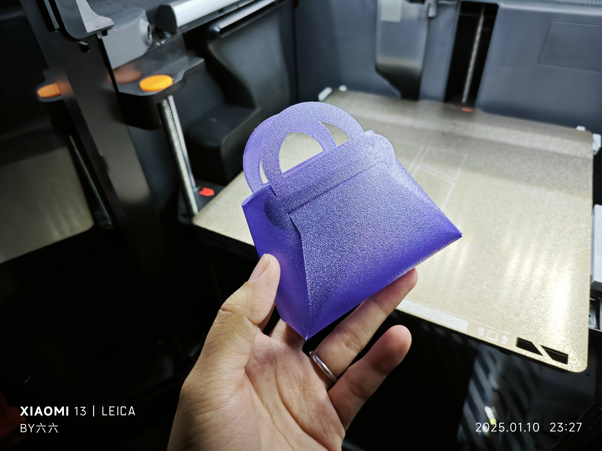
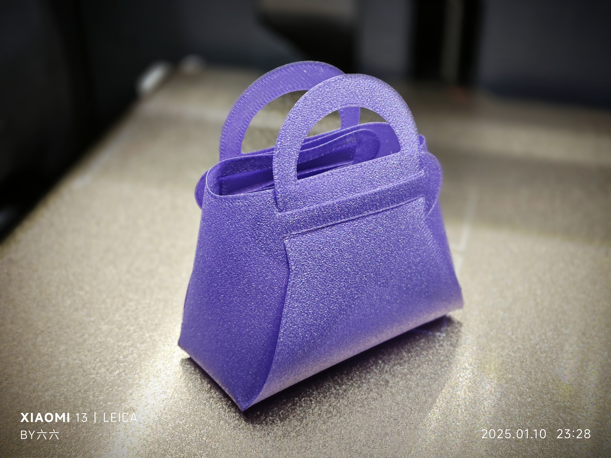
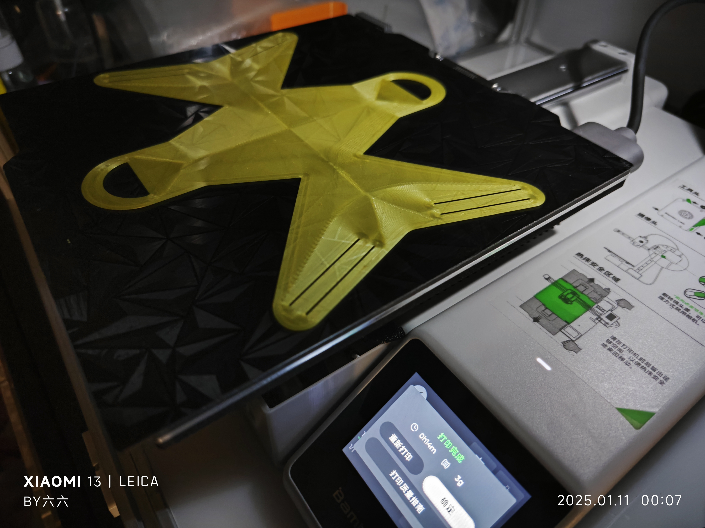
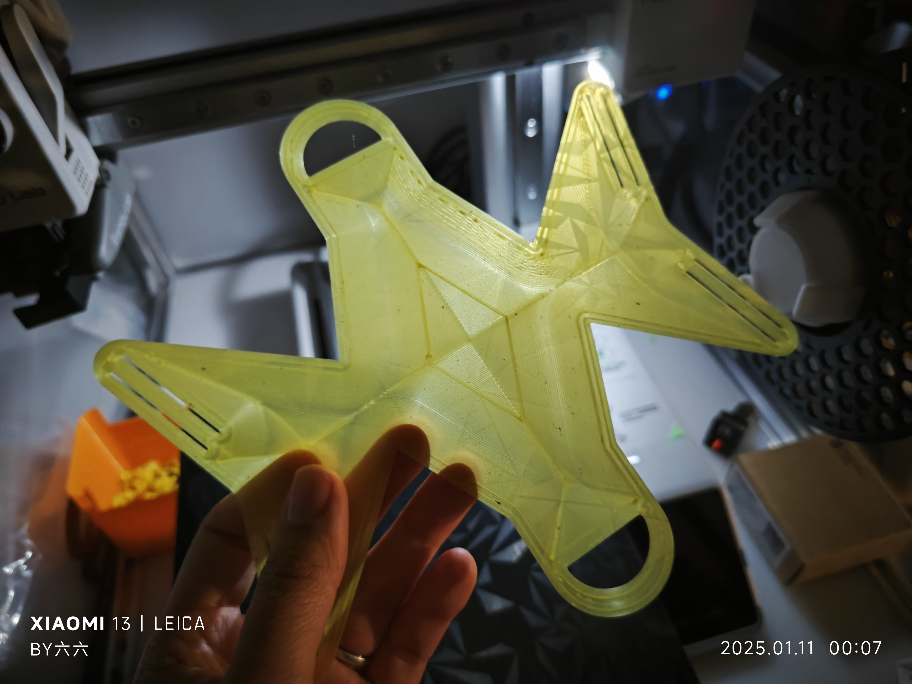
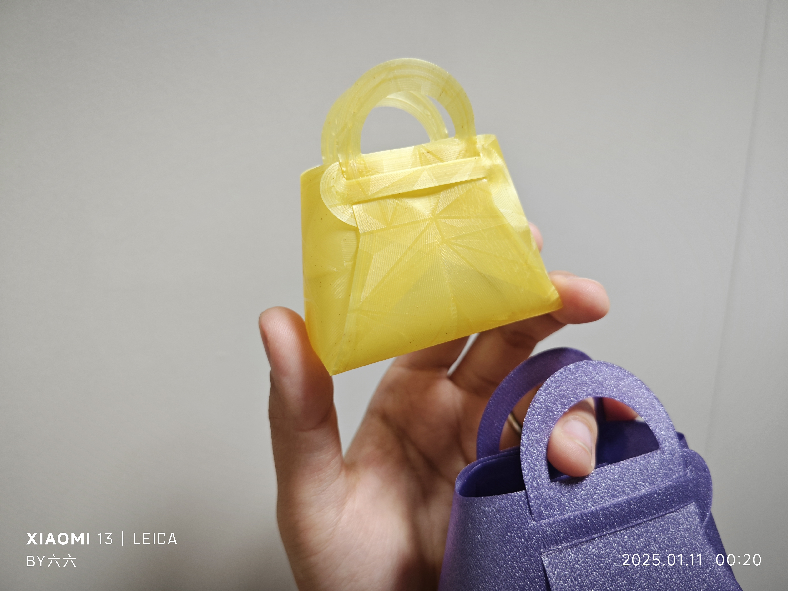
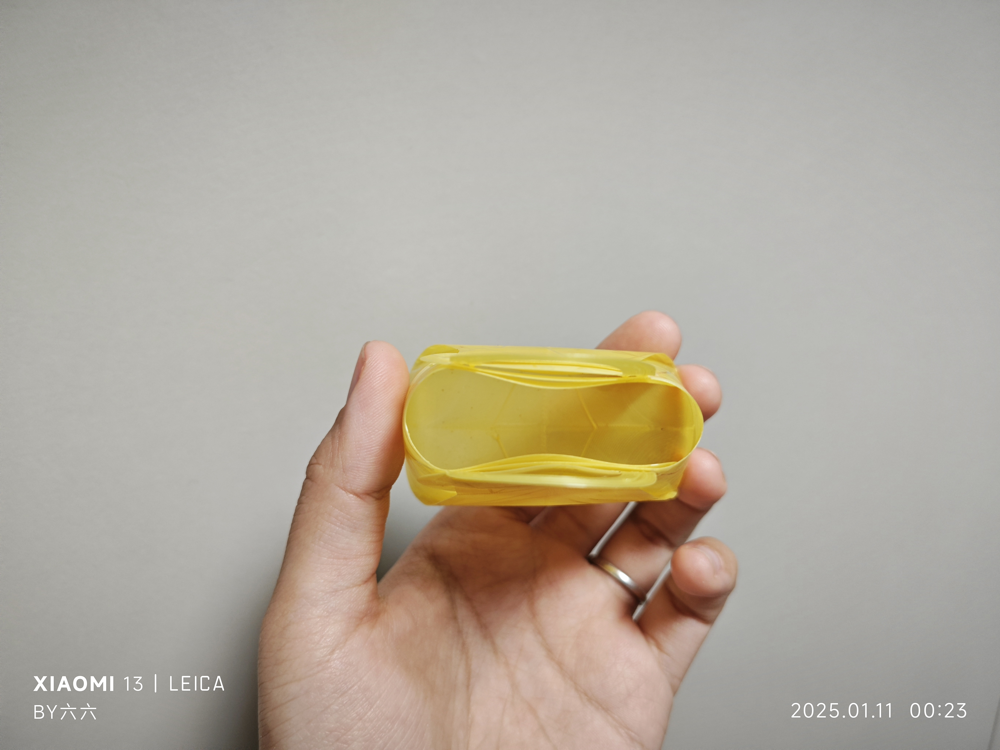
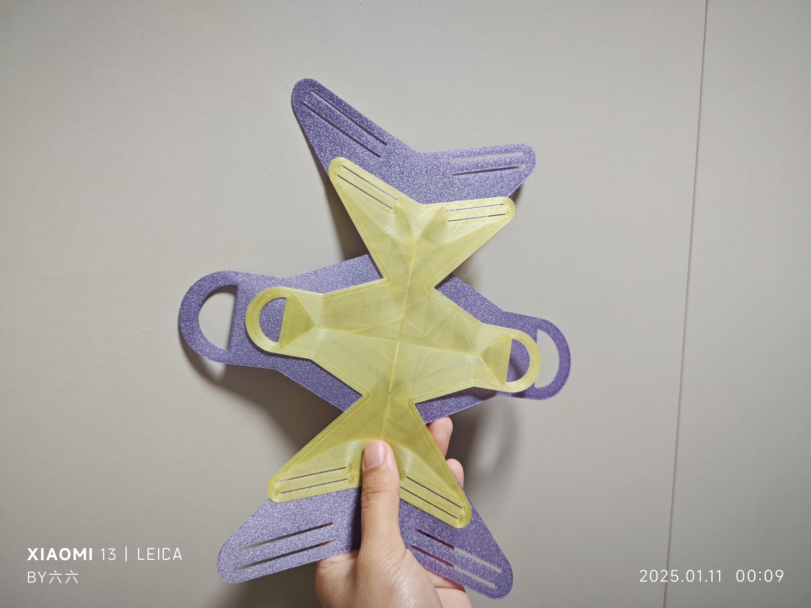
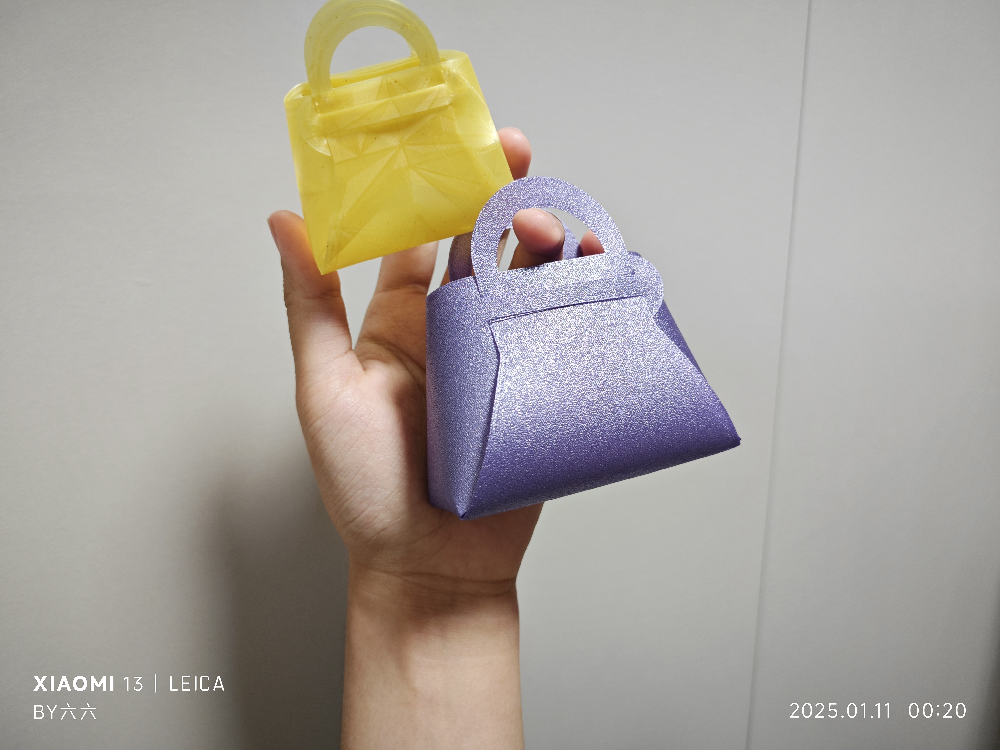

# 迷你提篮小包

## 描述
这是一个迷你提篮样式的小包。打印完成后，两侧提手分别从槽中穿入穿出，即可完成提篮的组装。可以作为娃包装饰或用于装糖果等小物品。

- **打印时间：** 20分钟
- **耗材使用：** 6g
- **打印层高：** 0.2mm
- **总高度：** 0.2mm
- - **成品尺寸：**
  - **底长：** 85 mm
  - **包体高度：** 60 mm
- 模型可以根据需要缩放。

### 适用于 A1 Mini 打印机
`miniBag(a1mini).3mf` 文件已经预先缩放，适配 A1 Mini 打印机的打印板。

- **打印时间：** 15分钟
- **耗材使用：** 3g
- **打印层高：** 0.2mm
- **总高度：** 0.2mm
- **成品尺寸：**
  - **底长：** 60.5 mm
  - **包体高度：** 42 mm
  
### 切片设置
- 3mf 文件的**底面图案**设置为 **同心**，以防止组装后角落撕裂。

## 实拍图
以下是打印完成后的一些实拍图：

a1mini:

对比:

## 文件
- `miniBag.stl`：用于打印模型的 STL 文件。
- `miniBag.3mf`：方便使用 Orca 或 Bambu Studio 打印的 3MF 文件。
- `miniBag(a1mini).3mf`：方便使用 Orca 或 Bambu Studio 打印的 3MF 文件。

## 组装步骤
1. 打印完成后，将提手从两侧的槽中穿入。
2. 调整提手位置，完成迷你提篮的组装。

## 设计理念
这款小包的设计经过优化，确保快速高效的打印，同时提供一个实用且装饰性强的成品。

## 许可证
本项目采用 [Creative Commons Attribution 4.0 International License](https://creativecommons.org/licenses/by/4.0/) 许可协议。
