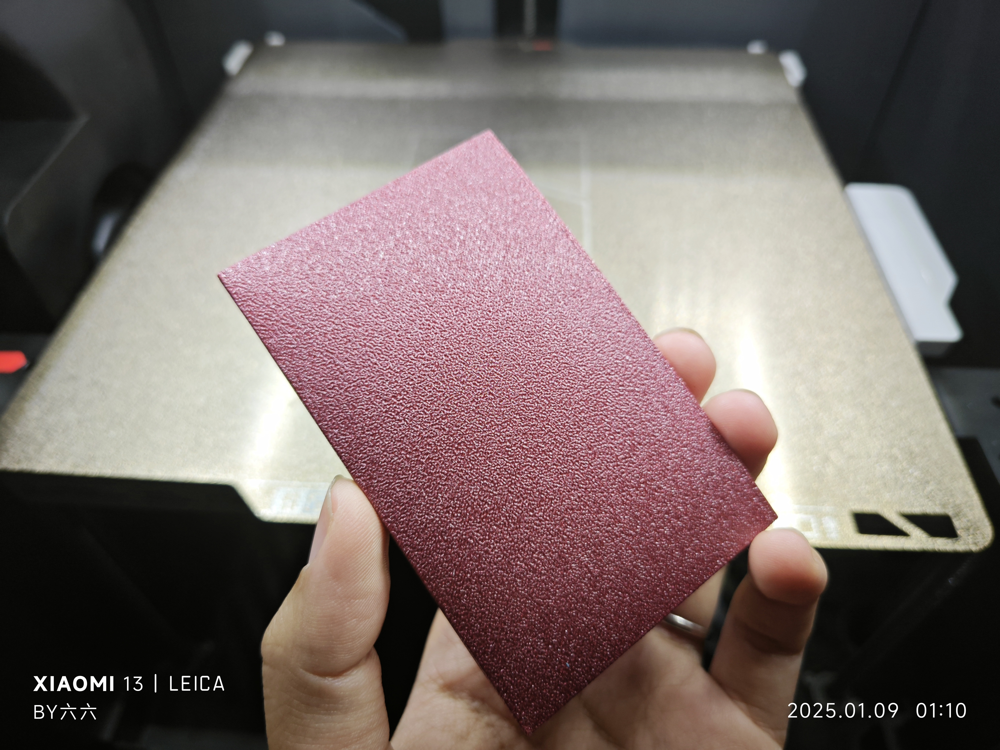

# Mini Card Case (Name Card Holder)

## Description
A compact and stylish mini card case that can hold five to six bank cards. Ideal for carrying a few essential cards in your pocket or bag.

- **Printing Time:** 27 minutes
- **Material Usage:** 12g
- **Layer Height:** 0.2mm
- **Total Height:** 0.4mm

## Files
- `miniCardCase.stl`: The STL file for printing the model.
- `miniCardCase.3mf`: The 3MF file for easy printing with Orca or Bambu Studio.

## How to Use
1. Use the `.3mf` file in Orca or Bambu Studio for easy printing.
2. Print the model to create a mini card case for five to six cards.
3. The card case is designed to hold bank cards, business cards, or any other essential cards you need to carry.

## Folding Steps
To assemble the card bag, follow these folding steps:

   

## Real Shots
Here are some real-life images of the printed model:

### Demonstration GIF

## Design Philosophy
This mini card case was designed to be compact and efficient. It minimizes material usage while offering a practical and functional design for everyday carry.

## License
This project is licensed under the [Creative Commons Attribution 4.0 International License](https://creativecommons.org/licenses/by/4.0/).
