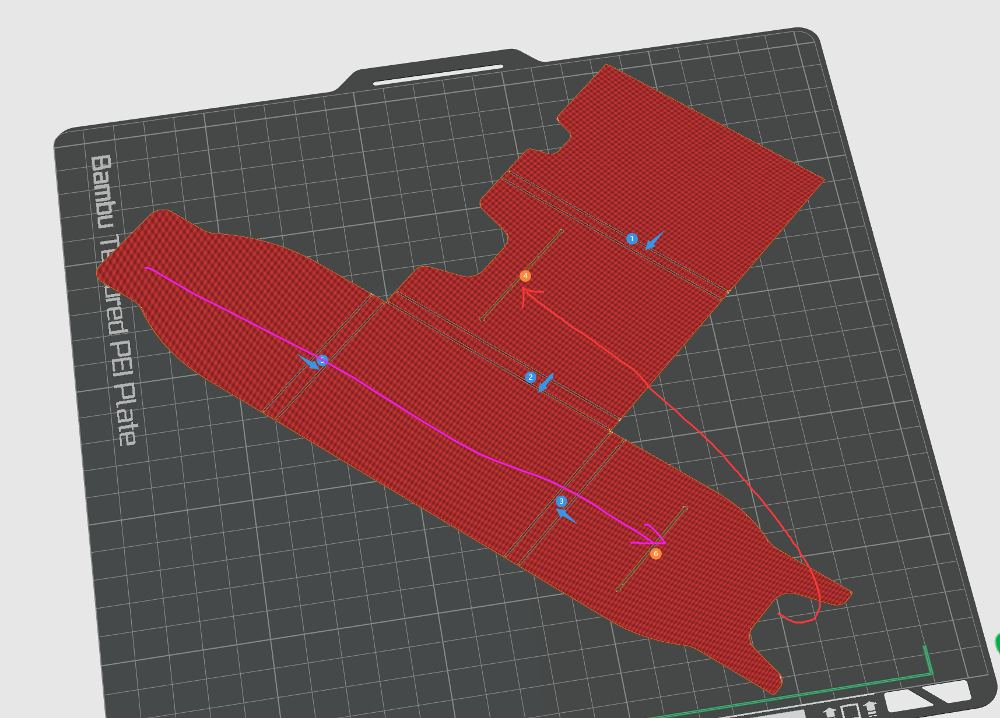
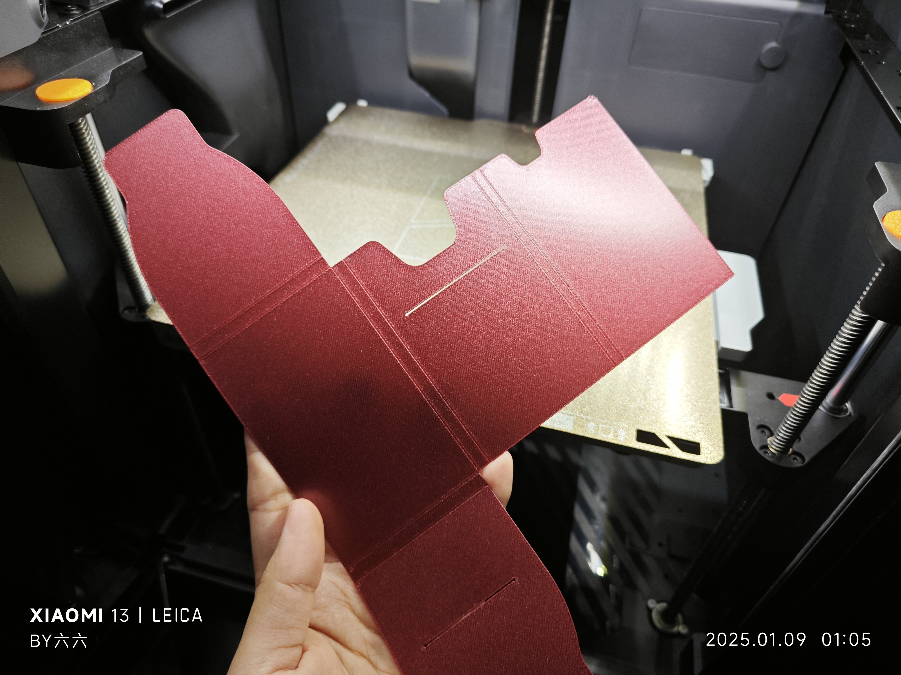
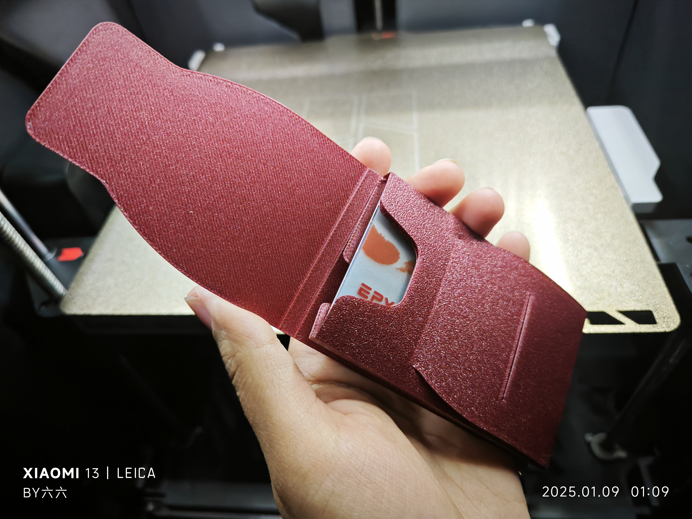
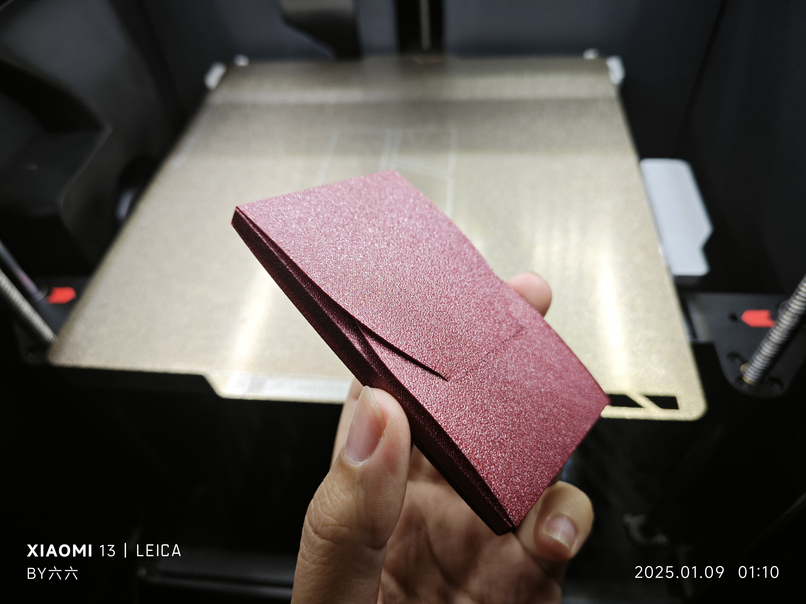
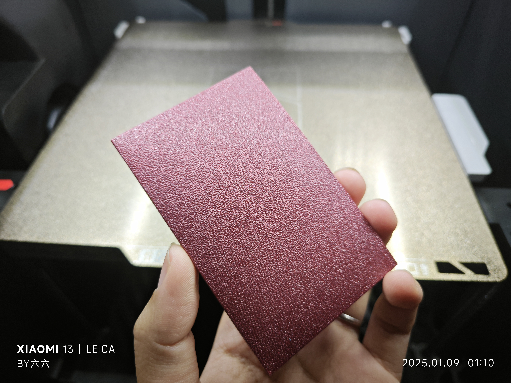

# Mini卡包（名片夹）

## 描述
一款紧凑型迷你卡包，可以容纳五到六张银行卡。非常适合日常携带几张必需的卡片。

- **打印时间：** 27分钟
- **耗材使用：** 12g
- **打印层高：** 0.2mm
- **总高度：** 0.4mm

## 文件
- `miniCardCase.stl`：用于打印模型的STL文件。
- `miniCardCase.3mf`：方便使用 Orca 或 Bambu Studio 打印的 3MF 文件。

## 使用方法
1. 使用 Orca 或 Bambu Studio 打开 `.3mf` 文件，方便打印。
2. 打印模型，创建一个迷你卡包，容纳五到六张银行卡。
3. 这款卡包设计用于容纳银行卡、名片或任何您需要携带的重要卡片。

## 折叠步骤
按照以下步骤进行卡包的折叠：

   

## 实拍图
以下是打印完成后的一些实拍图：

   

## 设计理念
这款迷你卡包设计简洁、紧凑，旨在为日常携带提供方便的卡片收纳功能。

## 许可证
本项目采用 [Creative Commons Attribution 4.0 International License](https://creativecommons.org/licenses/by/4.0/) 许可协议。
